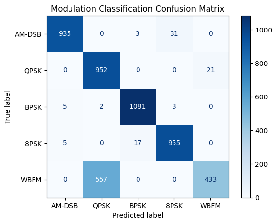

# 📡 RF Modulation Classification using CNN  
A deep learning project built using **PyTorch** to classify synthetic **Radio Frequency (RF) modulations** using spectrogram-like waveform data. The model is trained to distinguish between different modulation types like BPSK, QPSK, AM, FM, etc.

## 🚀 Features  
- 🧠 Trains a 1D **Convolutional Neural Network (CNN)** for signal classification  
- 🔁 Uses synthetic RF waveform data with 128-sample IQ pairs  
- 📈 Includes confusion matrix and accuracy visualization  
- 🔍 Predicts modulation class for new waveform inputs  
- 🔧 Easily extendable to real-world SDR applications  


## 📊 Performance  
- **Accuracy Achieved:** `82.3%`  
- **Loss:** `0.43`  
- 📌 *Confusion matrix shows good separation between AM, FM, PSK variants.*  



## 🧪 Sample Prediction  
Given an IQ waveform of shape `[2, 128]`, the trained model predicts:  
**Predicted Modulation:** `QPSK`  
*(Actual: QPSK)*

## 📂 Project Structure  
```
📁 rf-modulation-classifier  
│── 📄 train.py            # Model training logic  
│── 📄 rf_dataset_loader.py          # Sample prediction script  
│── 📄 rf_cnn_model.pt            
│── 📁 data/               # Synthetic RF data  

```
